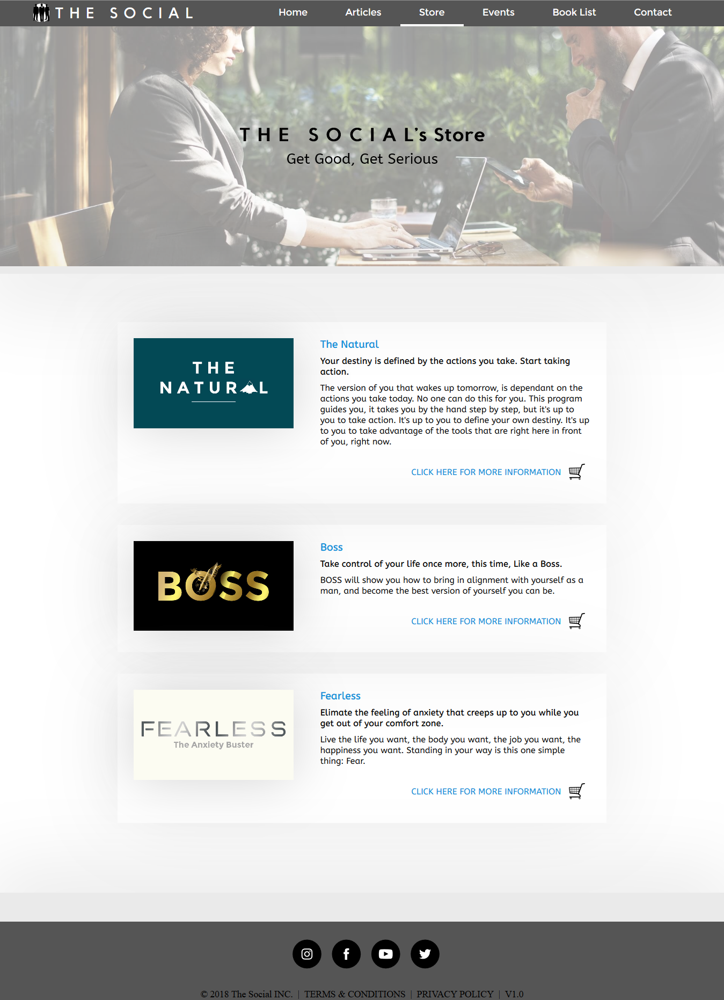
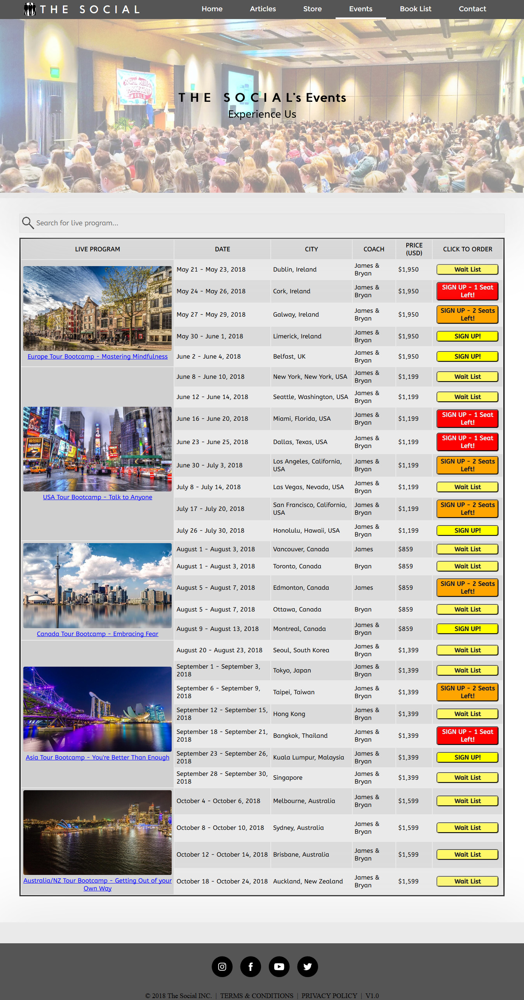

# The Social

Well-being website, aimed at the biophysical level of the self (i.e., social dynamics, self-improvement, self-actualization, self-discipline, etc). Beneficial for people of all ages who are interested in being better, or to be instilled with new possibilities.

&nbsp;
## Characteristics
- Company logo and Social Media icons are made using SVGs, which allows for excellent visual scaling.
- Company name gives visitors a near instant understanding of what the website is for (aimed to be a more sociable person).
- There is a coming soon and a checkout page.
- The Search tool in the Events page shows only the nearest (in terms of date) live programs because the filter algorithm doesn't take into account row span filtering.
- Google's API is used in the Contact page.
- Almost all media content are acquired from Pixabay.com, which offers CC0 Creative Commons art works.
- Geodata's API was used to provide a broad selection of countries, their states and their cities in the Contact and Checkout page.
- All images are compressed.
- PHP was initially used to include files and dates, but because GitHub pages only allow for static websites, almost the entire website have to rewritten to be static.
- Best viewed in Chrome.

&nbsp;
## Task
Design a promotional website targeted at an audience interested in joining a club/group in view of improving their personal fitness and/or well-being. Website should consists of 6 gradable pages.

&nbsp;
## Pages
### Homepage

&nbsp;
### Articles

&nbsp;
### Store

&nbsp;
### Events

&nbsp;
### Book List

&nbsp;
### Contact

